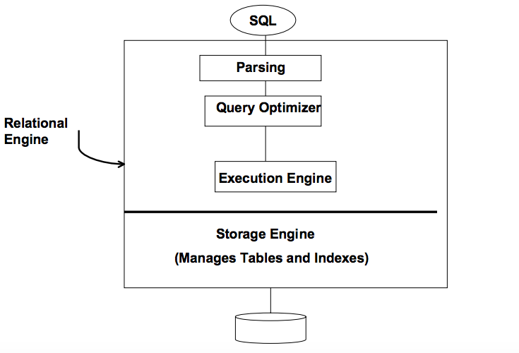
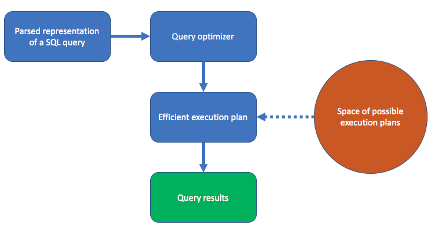
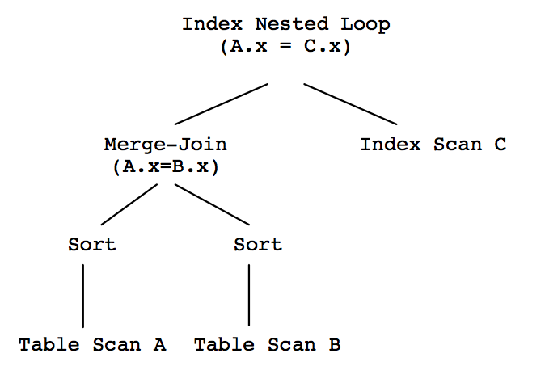
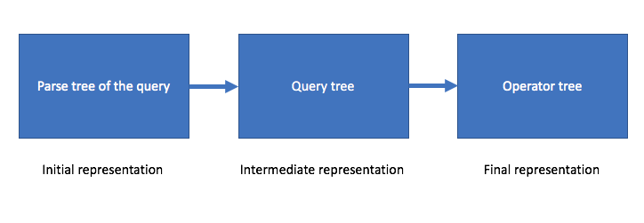
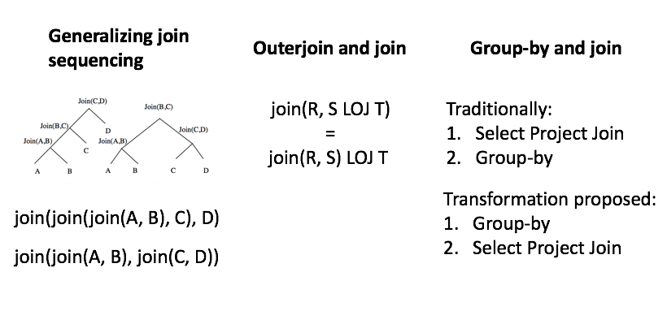
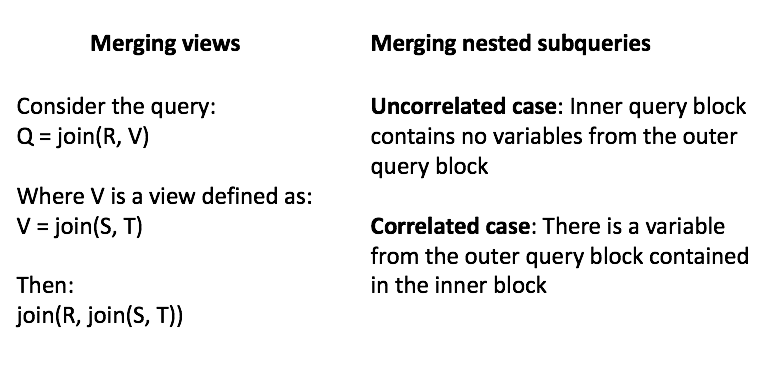
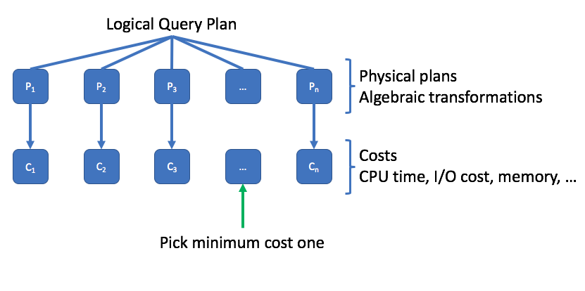
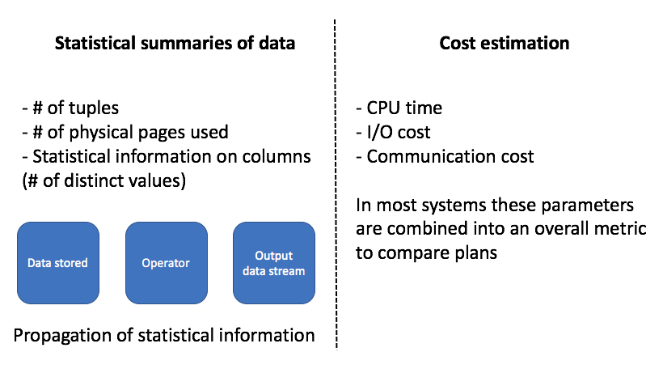
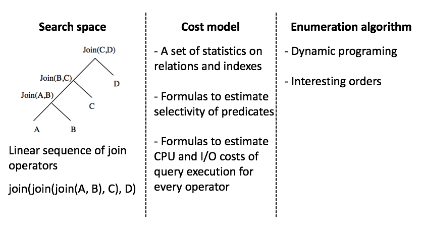
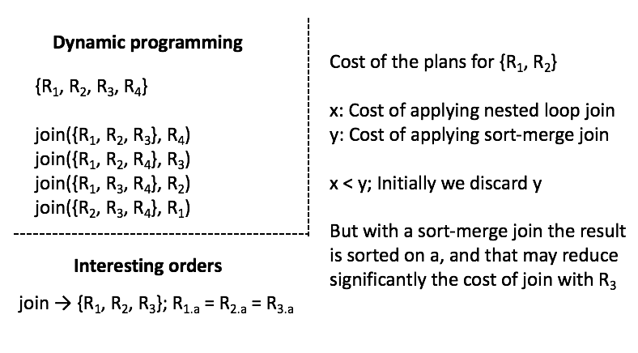

## About the author{.centered}

\n

Computer Scientist at Microsoft Research

Best known for his contributions to database management systems

Research group: Data Management, Exploration and Mining group

## Outline

- **Introduction**
- **Query optimization**
- Search space
- Cost estimation
- Enumeration algorithm
- **Example: System-R optimizer**
- **Conclusions**

## Relational DBMS components{.centered}

\n

## General view{.centered}

\n

## Query optimization

Issues to consider:

- Large number of possible execution plans for a query
- Response times for the execution of these plans may be widely different
- The choice of an execution by the optimizer is of critical importance

## Query optimization

It could be considered as a search problem among all possible execution plans.

- **Search space**: Set of possible plans which can be related to some algebraic transformation
- **Cost estimation**: Needs to be measured in terms of CPU time, memory, I/O cost, etc. And also, the estimation should be both accurate and efficient.
- **Enumeration algorithm**: This algorithm can search through the execution space.

This paper just focused on Select-Project-Join (SPJ) queries, because of their closely relation with the conjunctive queries.

## Desirable optimizer

- Its search space includes plans that have low cost
- The costing technique is accurate
- The enumerating algorithm is efficient

## Query evaluation{.centered}

\n

## Query evaluation

- **Query optimizer**: Generate the input for the execution engine so that it executes efficiently.
- **Query execution engine**: Operators for the execution of operations such as sort, sequential scan, index scan, etc.

## Search space: Queries as trees{.centered}

Execution plan = Physical operator tree

\n

## Search space: Queries as trees{.centered}

\n

## Search space

Depends on the set of algebraic transformations that preserve equivalence and the set of physical operators supported in an optimizer.

- Commuting between operators
- Reducing multi-block queries to single-block
- Using semijoin like techniques for optimizing multi-block queries

## Search space: Commuting between operators{.centered}

\n

## Search space: Reducing multi-block queries to single-block{.centered}

\n

## Search space: Using semijoin like techniques for optimizing multi-block queries

- Exploit selectivity of predicates across blocks
- Requires introducing new table expressions and views
- The goal is to avoid redundant computation in the views or the nested subqueries

## Cost estimation{.centered}

Which of the operator trees consumes least resources?

\n

## Cost estimation{.centered}

\n

## Enumeration algorithm

Build the enumerator that can adapt to changes:

- In search space due to addition of new transformations
- The addition of new physical operators
- Changes in the cost estimation techniques

Recent optimization architectures have been built with this paradigm: *extensible optimizers*.

## Enumeration algorithm: extensible optimizers

Starburst and Volcano/Cascade properties in common

- Use of generalized cost functions and physical properties with operator
- Use of a rule engine that allows transformations to modify the query expression or the operator trees
- Many exposed "knobs" that can be used to tune the behavior of the system

## Example: System-R optimizer{.centered}

\n

## Example: System-R optimizer{.centered}

\n

## Conclusions

- Optimization is much more than transformations and query equivalence
- Design effective and correct SQL transformations is not easy
- Develop a robust cost metric is elusive
- Build an enumeration algorithm is a significant undertaking

